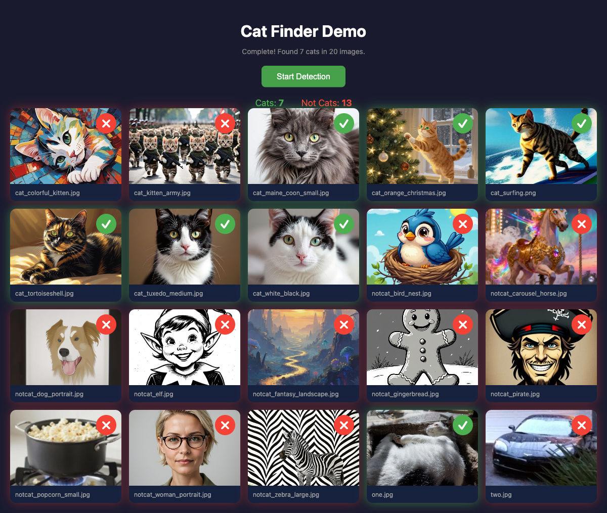

# Cat Finder

A Rust CLI tool that scans directories for photos containing cats using YOLO object detection.



## Quick Start

```bash
# Clone and set up in one command
git clone https://github.com/wrightmikea/cat-finder.git
cd cat-finder
./setup.sh

# Scan for cats
./scripts/run.sh ~/Pictures
```

## Installation

### One-Command Setup

The setup script handles everything—checks for Rust, downloads the model, and builds:

```bash
./setup.sh
```

### Manual Installation

If you prefer to set up manually:

1. Install Rust via [rustup.rs](https://rustup.rs) (version 1.85+)
2. Download the YOLO model:
   ```bash
   ./scripts/download_models.sh
   ```
3. Build the project:
   ```bash
   cargo build --release
   ```

### Requirements

- **Rust 1.85+** (2024 edition)
- **~80MB disk space** (model + ONNX Runtime + binary)
- **No cloud APIs, Ollama, or LLMs required** — runs entirely locally

## Usage

```bash
cat-finder [OPTIONS] [PATH]
```

### Arguments
- `PATH` - Directory to scan for images (default: current directory)

### Options
- `-v, --verbose` - Show detailed progress
- `-t, --timestamp` - Show file timestamps
- `--confidence <FLOAT>` - Detection confidence threshold (0.0-1.0, default: 0.25)
- `--model <PATH>` - Path to ONNX model (default: models/yolov8n.onnx)

## Examples

```bash
# Scan current directory
cat-finder

# Scan with verbose output
cat-finder --verbose ~/Dropbox/Photos

# Lower confidence threshold for more detections
cat-finder --confidence 0.1 ~/Pictures

# Use with timestamps
cat-finder -t ~/Photos
```

## Model Information

The tool uses YOLOv8n (nano) by default, which can detect 80 object classes including cats. The model achieves good accuracy while being fast enough for scanning large photo collections. All inference runs locally via ONNX Runtime—no cloud APIs or external services required.

### Detection Classes
The model can detect: person, bicycle, car, motorcycle, airplane, bus, train, truck, boat, traffic light, fire hydrant, stop sign, parking meter, bench, bird, **cat**, dog, horse, sheep, cow, elephant, bear, zebra, giraffe, and many more.

### Accuracy Considerations

Detection accuracy is not 100%. The model may miss some cats or occasionally produce false positives. Factors that affect detection:

- **Image quality**: Blurry, low-resolution, or poorly lit photos reduce detection confidence
- **Artistic styles**: Highly stylized illustrations, cartoons, or abstract art may not be recognized as cats since the model was trained primarily on photographs
- **Partial visibility**: Cats that are partially obscured, cropped, or very small in the frame may not be detected
- **Unusual poses**: Cats in atypical positions or angles may be harder to recognize
- **Confidence threshold**: The default threshold (0.25) balances precision and recall; adjust with `--confidence` for your use case

For best results, use clear photographs where cats are reasonably visible and occupy a meaningful portion of the frame.

## Troubleshooting

### macOS: Library not loaded error
Use the DYLD_LIBRARY_PATH environment variable:
```bash
DYLD_LIBRARY_PATH=target/release ./target/release/cat-finder
```

Or use the provided script:
```bash
./scripts/run.sh [path]
```

### Model file not found
Run the download script:
```bash
./scripts/download_models.sh
```

## Testing

Run the test script to verify the installation:

```bash
./scripts/test.sh
```

**Expected results:**
- 20 sample images in `samples/`
- 9 images depict cats
- 11 images do not contain cats (`two.jpg`, `notcat_*.jpg`)

**Actual detection results:** `Images with cats: 7` (model misses 2 of 9 cat images)

This demonstrates the model is not perfect. Two cat images are not detected:
- `cat_colorful_kitten.jpg`: Mosaic/oil painting style with unnatural multi-colored fur blending into abstract background
- `cat_kitten_army.jpg`: Anthropomorphized cats walking upright in military uniforms—bipedal pose and clothing obscure natural cat features

See [Accuracy Considerations](#accuracy-considerations) for more on detection limitations.

## Development

Built with:
- Rust 2024 edition
- ONNX Runtime for local inference
- YOLOv8n for object detection
- clap for CLI parsing
- image for image processing

See [docs/usage.md](docs/usage.md) for detailed installation and usage instructions.

## License

MIT License — Copyright (c) 2025-2026 Michael A. Wright

See [LICENSE](LICENSE) for details.